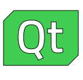
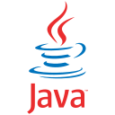

<h1 align="center">
  
</h1>

<h5 align="center">
  <code><a href="https://www.linkedin.com/in/yassine-dehhani/" title="LinkedIn Profile"> LinkedIn</a></code>
</h5>
 

  Hi, I'm Yassine DEHHANI, a Robotics & Systems Engineering Student located in Bordeaux, France.
   
   
  🔬 I'm currently working as an apprentice Robotics Engineer at Lucas Robotics Systems.
   
  🎓 I'm preparing a Master Degree in Embedded Systems.
   
  💻 I love writing software, build printed circuit boards (PCBs) and design aerospace systems.
   
  📚 I’m currently working on a powerful Flight Computer build from scratch, and a CubeSat!
   
  📫 How to reach me: <a href="mailto: ydehhani@gmail.com">ydehhani@gmail.com</a>

<h2 align="center">🔥 Languages & Frameworks & Tools & Abilities 🔥</h2>
 

  <code></code>
  <code></code>
  <code></code>
  <code></code>
  <code></code>
  <code></code>
  <code></code>
  <code></code>
  <code></code>
  <code></code>
  <code></code>
  <code></code>
  <code></code>
  <code></code>
  <code></code>
  <code></code>
  <code></code>
  <code></code>
  <code></code>
  <code></code>
  <code></code>
  <code></code>
  <code></code>
  <code></code>
  <code></code>
  <code></code>
  <code></code>
  <code></code>
  <code></code>
  <code></code>

<h2 align="center">⚡ Stats ⚡</h2>
 

  

    
    
        
  

           

   

  

<h2 align="center">👨‍💻 Repositories 👨‍💻</h2>
 

  

      

  
      

<h4 align="center">
  <a href="https://github.com/yaxsomo?tab=repositories" title="Show Repositories">🔎 Show More 🔍</a>
</h4>

<!--
**zumrudu-anka/zumrudu-anka** is a ✨ _special_ ✨ repository because its `README.md` (this file) appears on your GitHub profile.

Here are some ideas to get you started:

- 🔭 I’m currently working on ...
- 🌱 I’m currently learning ...
- 👯 I’m looking to collaborate on ...
- 🤔 I’m looking for help with ...
- 💬 Ask me about ...
- 📫 How to reach me: ...
- 😄 Pronouns: ...
- ⚡ Fun fact: ...

Notes: If you want use this readme, firstly star it please. If you can't align your repositories like this, please change your repository desription to shorter than now. Maybe 4 or 5 word will be good.

-->
